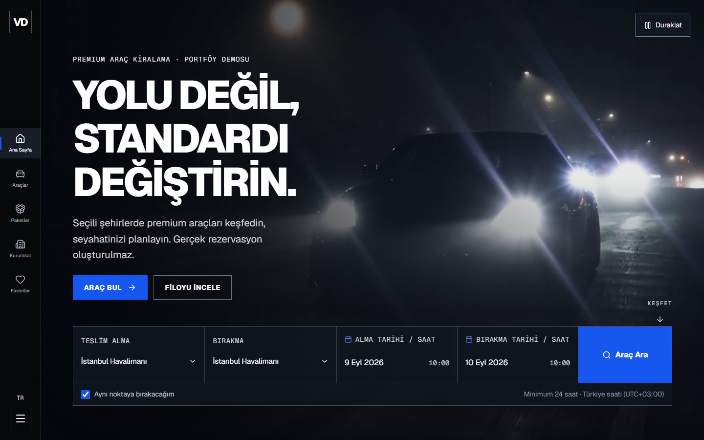
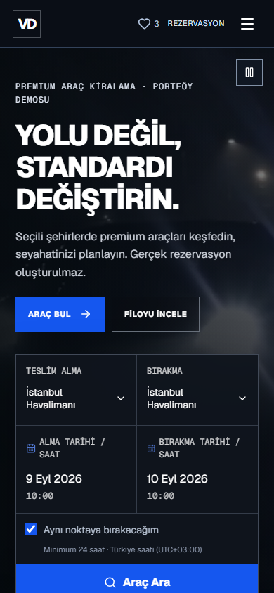
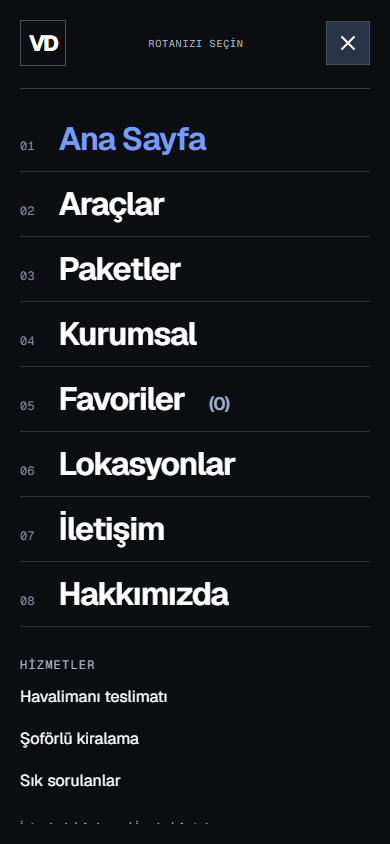
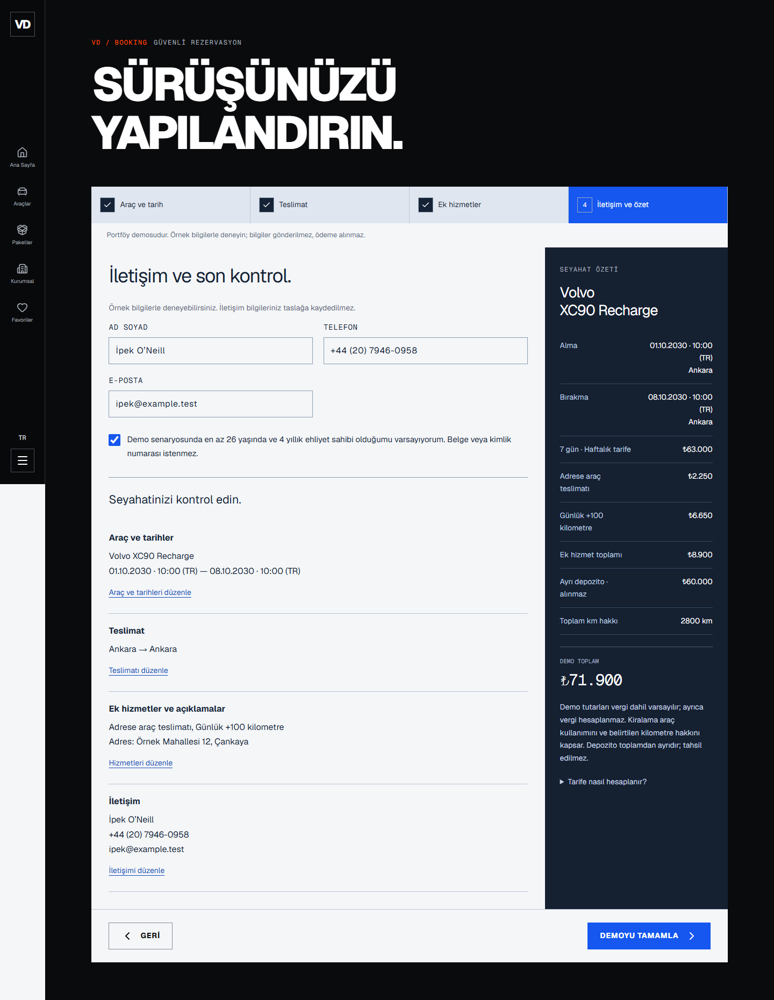

<p align="center">
  
</p>

<h1 align="center">VANTA DRIVE</h1>

<p align="center">
  <strong>Yolu değil, standardı değiştirin.</strong><br />
  Premium araç keşfinden rezervasyon planlamaya uzanan Türkçe portföy demosu.
</p>

<p align="center">
  <a href="https://vanta-drive.furkan-akpinar.workers.dev"><strong>Canlı demoyu keşfet ↗</strong></a>
</p>

<p align="center">
  
  
  
  
  <a href="https://github.com/furkan-akpinar/vanta-drive/actions/workflows/ci.yml?query=branch%3Acodex%2Fvanta-drive-revision"></a>
</p>

<p align="center">
  <a href="#konsept">Konsept</a> ·
  <a href="#ekran-goruntuleri">Ekran görüntüleri</a> ·
  <a href="#ozellikler">Öne çıkanlar</a> ·
  <a href="#teknoloji">Teknoloji</a> ·
  <a href="#kurulum">Kurulum</a> ·
  <a href="#kontroller">Kontroller</a> ·
  <a href="#yayin">Yayın</a>
</p>

---

<a id="konsept"></a>

## Konsept

VANTA DRIVE, premium araç kiralama deneyimini **20 konsept araç**, **6 teslimat noktası** ve **4 adımlı rezervasyon akışı** üzerinden sunar. Grafit yüzeyler, mavi ve turuncu vurgular, yerel Geist tipografisi ve otomotiv görüntüleri; katalogdan son kontrol ekranına kadar ortak bir görsel dil oluşturur.

Proje, tasarım ve uygulama geliştirme yetkinliğini göstermek için hazırlanmıştır. Gerçek rezervasyon, ödeme veya talep gönderimi yapmaz; araç müsaitliği ve fiyatlar demo senaryosudur.

<a id="ekran-goruntuleri"></a>

## Ekran görüntüleri

8 Eylül 2026'da çalışan **yerel üretim çıktısından** alınan gerçek arayüz görüntüleri. Ana sayfa masaüstünde **1440×900**, mobilde **390×844** CSS viewport ile kaydedilmiştir.



<details>
  <summary><strong>Mobil ana sayfa ve tam ekran menü</strong></summary>
  <br />
  <p align="center">
    
    
  </p>
</details>

<details>
  <summary><strong>Rezervasyonun son kontrol ekranı</strong></summary>
  <br />
  <p align="center">
    
  </p>
</details>

<a id="ozellikler"></a>

## Öne çıkanlar

- **Paylaşılabilir katalog:** marka, sınıf, yakıt, lokasyon ve fiyat filtreleri; arama, sıralama ve görünüm tercihleri URL'de korunur. İlk sunucu yanıtı araç kartlarını içerir; geri/ileri gezinme desteklenir.
- **Araç keşfi:** 20 araç detay sayfası, teslimat uyumluluğu, kiralama koşulları, favoriler ve en fazla üç araçla karşılaştırma. Hassas olmayan seçimler yenilemede korunur.
- **Tutarlı rezervasyon:** araç ve tarih, teslimat, ek hizmetler, iletişim ve son kontrol. Düzenlenebilir özet, açık fiyat kırılımı ve kişisel bilgi içermeyen demo sonucu.
- **Lokasyon ve hizmet sayfaları:** altı teslimat noktası; kurumsal, havalimanı ve şoförlü kiralama senaryoları, sık sorulan sorular ve örnek hizmet formları.
- **Duyarlı ve erişilebilir etkileşimler:** kaydırılabilir tam ekran mobil menü, arka sayfa kaydırma kilidi, Escape ile kapatma, odak dönüşü, klavye gezinmesi ve azaltılmış hareket desteği.
- **Ekrana uygun medya ve metadata:** yerel WebP görseller, masaüstü/mobil H.264 video ve poster desteği; sayfaya özel canonical, Open Graph, Twitter kartları, sitemap ve özel 404.

### Demo yolculuğu

**Ana sayfa / lokasyon → katalog → araç detayı → rezervasyon → son kontrol → demo özeti**

Tarih ve teslimat tercihleri sayfalar arasında taşınır. Araç–lokasyon uyumsuzlukları açıklanır; kullanıcı seçimi sessizce değiştirilmez. Açık seyahat URL'si yeni yolculuk başlatır ve eski taslağa üstün gelir.

<details>
  <summary><strong>Tarih ve fiyat hesaplama kuralları</strong></summary>

- Tarih ve saatler **Europe/Istanbul (UTC+03:00)** olarak yorumlanır; sunucu veya tarayıcı saat dilimi sonucu değiştirmez.
- Minimum süre **24 saat**; başlanan ek gün tam gün sayılır.
- **1–6 gün:** günlük tarife. **7–29 gün:** haftalık tarife / 7. **30+ gün:** aylık tarife / 30. Seçilen oran tüm süreye uygulanır.
- Paket eşiğinde toplam düşebilir: Porsche 911 Carrera için 29 gün **459.857 TL**, 30 gün **390.000 TL** bilinçli demo politikasıdır.
- Günlük hizmetler süreyle çarpılır; tek seferlik hizmetler bir kez eklenir. Ek kilometre paketi günlük **100 km** sağlar. Depozito kiralama toplamından ayrı gösterilir.
- Havalimanı karşılama uçuş numarası, adrese teslim adres gerektirir. Geçmiş veya ters tarihler düzeltilmeden ilerlenemez.

Ortak hesaplama ve doğrulama kaynağı: [lib/booking.ts](lib/booking.ts). Araç tarifeleri: [data/vehicles.ts](data/vehicles.ts). Ek hizmetler: [data/content.ts](data/content.ts).

</details>

<a id="teknoloji"></a>

## Teknoloji

| Katman                    | Kullanılan yapı                                                                  |
| ------------------------- | -------------------------------------------------------------------------------- |
| Arayüz                    | React 19.2.8, TypeScript 5.9.3                                                   |
| Uygulama                  | Vinext 1.0.0-beta.9 ile Next.js App Router API'leri                              |
| Derleme ve çalışma zamanı | Vite 8.2.2, Cloudflare Vite eklentisi, Cloudflare Workers                        |
| Tasarım ve etkileşim      | Tailwind CSS 4, özel CSS, Base UI / Shadcn, Embla, Framer Motion                 |
| Tipografi ve medya        | Yerel Geist / Geist Mono, WebP görseller, H.264 video                            |
| Kalite                    | Oxlint, Oxfmt, TypeScript, Node.js kontrol betikleri, Playwright, GitHub Actions |

`next/*` importları **Vinext uyumluluk katmanını** kullanır. Derleme Vinext üzerinden çalışır; sunucu tarafı Cloudflare Workers üzerinde yürütülür. Kesin bağımlılık sürümleri [package.json](package.json) ve [package-lock.json](package-lock.json) içinde korunur.

<a id="kurulum"></a>

## Kurulum

**Node.js 22.13+** ve npm gerekir. Güncel revizyon `codex/vanta-drive-revision` dalındadır.

```powershell
git clone --branch codex/vanta-drive-revision https://github.com/furkan-akpinar/vanta-drive.git
cd vanta-drive
npm.cmd ci
npm.cmd run dev
```

Geliştirme sunucusu: `http://localhost:3000`. Komutlar Windows PowerShell içindir; diğer ortamlarda `npm.cmd` ve `npx.cmd` yerine `npm` ve `npx` kullanılabilir. `npm ci`, lockfile'daki sürümleri kurar.

### Üretim derlemesi ve yerel önizleme

```powershell
$env:NEXT_PUBLIC_SITE_URL='https://vanta-drive.furkan-akpinar.workers.dev'
npm.cmd run build
npm.cmd run start -- --port 3001
```

Yerel üretim Worker'ı: `http://127.0.0.1:3001`. Sunucu `dist/server/wrangler.json` yapılandırmasını kullanır; kaynak değişikliklerinden sonra yeniden derleme gerekir.

`NEXT_PUBLIC_SITE_URL`, **derleme sırasında** canonical, paylaşım görselleri ve sitemap için kullanılır. POSIX karşılığı: `NEXT_PUBLIC_SITE_URL=https://vanta-drive.furkan-akpinar.workers.dev npm run build`. Değişken verilmezse yerel önizleme yayın adresi uydurmaz; sitemap boş kalır ve mutlak paylaşım adresleri üretilmez. Ortam şablonu: [.env.example](.env.example).

<a id="kontroller"></a>

## Kontroller

| Komut                         | Kapsam                                                                                    |
| ----------------------------- | ----------------------------------------------------------------------------------------- |
| `npm.cmd run check`           | TypeScript, lint; tarih, fiyat, taslak, filtre ve telefon doğrulaması; dört saat dilimi   |
| `npm.cmd run format:check`    | Kaynak ve dokümantasyon biçimi                                                            |
| `npm.cmd run build`           | Vinext / Vite üretim derlemesi ve Worker çıktısı                                          |
| `npm.cmd run test:ui`         | Katalog, favoriler, karşılaştırma, formlar ve mobil/masaüstü demo yolculukları            |
| `npm.cmd run test:layout`     | Sayfa, bağlantı, medya, 404, kontrast ve duyarlı yerleşim kontrolleri                     |
| `node scripts/check-menu.mjs` | Menü geometrisi, içerik kaydırması, arka sayfa kilidi, odak, yön değişimi ve sayfa geçişi |
| `node scripts/check-live.mjs` | Mevcut canlı URL'de rotalar, SEO metadata'sı, medya ve mobil/masaüstü sayfalar            |

Tarayıcı testleri için önce üretim çıktısını derleyip yerel Worker'ı çalıştırın. Ardından **ayrı terminalde**:

```powershell
npx.cmd playwright install chromium webkit
$env:BASE_URL='http://127.0.0.1:3001'
npm.cmd run test:ui
npm.cmd run test:layout
$env:MENU_BROWSERS='chromium,webkit'
node scripts/check-menu.mjs
```

**Kaydedilmiş doğrulamalar:** 96 etkileşim/yolculuk kontrolü; Chromium ve WebKit'te 12 profil üzerinde 353 menü kontrolü. Menü matrisi 320, 360, 390, 430 px; 844×390 yatay mobil ve 1440×900 masaüstünü kapsar. Fiziksel iOS Safari veya Android Chrome cihaz testi yapılmamıştır; mobil profiller tarayıcı benzetimidir.

[Checks iş akışı](.github/workflows/ci.yml) kaynak kontrollerini, üretim derlemesini ve yerel tarayıcı testlerini çalıştırır. Revizyon dalında ayrıca yayımlanmış Worker'ı sınayan `live` işi bulunur. Sonuçlar `browser-qa` ve `live-browser-qa` artifact'lerinde saklanır. **CI otomatik yayın yapmaz.**

Yerel raporlar `outputs/qa`, `outputs/menu` ve `outputs/live` altında üretilir; Git'e alınmaz. Tarihli test sonuçları, Lighthouse laboratuvar ölçümleri ve ortam kısıtları [revizyon kaydında](docs/REVISION.md) bulunur.

## Proje yapısı

```text
app/                  Sayfalar, metadata, ortak stiller, sitemap ve 404
components/           Navigasyon, katalog, rezervasyon ve arayüz bileşenleri
data/                 Araçlar, sınıflar, lokasyonlar ve hizmet içerikleri
lib/                  Rezervasyon kuralları, veri saklama ve SEO yardımcıları
hooks/                Ortak React hook'ları
public/               Görseller, videolar, favicon ve yerel fontlar
scripts/              İş kuralı, tarayıcı, düzen ve canlı kontrol betikleri
docs/                 Proje incelemesi, revizyon kaydı ve ekran görüntüleri
.github/workflows/    GitHub Actions kontrolleri
vite.config.ts        Vinext ve Cloudflare Worker yapılandırması
```

**İçerik düzenleme:** araçlar ve tarifeler [data/vehicles.ts](data/vehicles.ts), sınıflar [data/classes.ts](data/classes.ts), lokasyonlar ve hizmetler [data/content.ts](data/content.ts) üzerinden yönetilir. Medya değişikliklerinde [kaynak kaydı](ASSET-SOURCES.md) da güncellenmelidir.

`node_modules/`, `dist/`, önbellekler, gerçek `.env` dosyaları ve geçici test kayıtları [.gitignore](.gitignore) ile depo dışında tutulur. Lockfile, `.env.example`, kaynaklar, gerekli medya, testler ve belgeler korunur.

<a id="yayin"></a>

## Yayın

**Canlı demo:** [vanta-drive.furkan-akpinar.workers.dev](https://vanta-drive.furkan-akpinar.workers.dev)

Uygulama Cloudflare Workers üzerinde **`vanta-drive`** adıyla yayımlanır. [Vite yapılandırması](vite.config.ts), `dist/server/index.js` sunucu girişini, `dist/client/` statik varlıklarını ve `dist/server/wrangler.json` yayın yapılandırmasını üretir. Yalnızca statik dosyaları GitHub Pages'e yüklemek yeterli değildir.

<details>
  <summary><strong>Mevcut Worker'a tekrar yayınlama · PowerShell</strong></summary>

Doğrulanmış revizyon dalında ve temiz çalışma ağacıyla ilerleyin. İlk klonda `npm.cmd ci` gerekir; her yayın için yeniden kurulum yapılmaz. Oturum yoksa `npx.cmd wrangler login` çalıştırın. `whoami` çıktısındaki hesabın aşağıdaki hesapla ve paneldeki Worker'ın bu projeyle eşleştiğini doğrulayın.

```powershell
git switch codex/vanta-drive-revision
git pull --ff-only origin codex/vanta-drive-revision
if ($LASTEXITCODE -ne 0) { throw 'Uzak dal alınamadı.' }
git status --short --branch
git rev-parse HEAD
npx.cmd wrangler whoami

$env:CLOUDFLARE_ACCOUNT_ID='ad296caa8366ac41c6b7770429d1ec3b'
$env:NEXT_PUBLIC_SITE_URL='https://vanta-drive.furkan-akpinar.workers.dev'
npm.cmd run check
if ($LASTEXITCODE -ne 0) { throw 'Kaynak kontrolleri başarısız.' }
npm.cmd run format:check
if ($LASTEXITCODE -ne 0) { throw 'Biçim kontrolü başarısız.' }
npm.cmd run build
if ($LASTEXITCODE -ne 0) { throw 'Üretim derlemesi başarısız.' }
$config = Get-Content -Raw dist/server/wrangler.json | ConvertFrom-Json
if ($config.name -ne 'vanta-drive' -or $config.main -ne 'index.js' -or $config.assets.directory -ne '../client') {
  throw 'Beklenmeyen Worker çıktısı.'
}
npx.cmd wrangler deploy --config dist/server/wrangler.json
if ($LASTEXITCODE -ne 0) { throw 'Yayın başarısız.' }
npx.cmd wrangler deployments list --config dist/server/wrangler.json
```

Yayın öncesinde gönderilen commit'in CI sonucunu kontrol edin. Üretilen yapılandırmayı elle değiştirmeyin; origin değişirse yeni değerle tekrar derleyin. Kimlik bilgilerini kaynak koda veya Git'e yazmayın.

Yayın sonrasında:

```powershell
node scripts/check-live.mjs
if ($LASTEXITCODE -ne 0) { throw 'Canlı sayfa kontrolleri başarısız.' }
$env:BASE_URL='https://vanta-drive.furkan-akpinar.workers.dev'
npm.cmd run test:ui
if ($LASTEXITCODE -ne 0) { throw 'Canlı demo yolculukları başarısız.' }
$env:MENU_BROWSERS='chromium,webkit'
node scripts/check-menu.mjs
if ($LASTEXITCODE -ne 0) { throw 'Canlı menü kontrolleri başarısız.' }
```

</details>

Yayınlanan kaynak commit'leri, Cloudflare sürüm kimlikleri, CI bağlantıları ve canlı kabul sonuçları [revizyon kaydında](docs/REVISION.md) tutulur.

## Demo sınırları ve veri

Gerçek ödeme, rezervasyon/talep gönderimi, müşteri veritabanı, üyelik, yönetim paneli, e-posta/SMS, uçuş takibi veya canlı envanter yoktur. Talep üzerine sunulan araçların demo sonucu müsaitlik onayı anlamına gelmez. Formları örnek bilgilerle kullanın.

Ad, telefon, e-posta, adres, uçuş ve mesaj bilgileri yalnızca açık formda tutulur; URL, localStorage, log veya analitiğe yazılmaz. Tamamlanmada iletişim alanları ve rezervasyon taslağı temizlenir. Tarayıcıda yalnızca `vanta-favorites`, `vanta-compare` ve hassas olmayan `vanta-booking` tercihleri saklanır; depolama kullanılamazsa oturum içi bellek kullanılır.

## Belgeler

| Belge                                  | İçerik                                                               |
| -------------------------------------- | -------------------------------------------------------------------- |
| [Proje incelemesi](docs/CASE-STUDY.md) | Tasarım yaklaşımı, seyahat modeli ve teknik kararlar                 |
| [Revizyon kaydı](docs/REVISION.md)     | Değişiklikler, gerçek test sonuçları, yayın geçmişi ve açık maddeler |
| [Medya kaynakları](ASSET-SOURCES.md)   | Görsel atıfları, düzenlemeler ve lisans kayıtları                    |
| [Ortam şablonu](.env.example)          | Yayın origin'i ve isteğe bağlı geliştirme ayarı                      |

## Lisans ve atıflar

Proje için ayrı bir kök lisans dosyası tanımlanmamıştır. Üçüncü taraf bağımlılıkların lisansları ilgili paketlerde korunur. Yerel fontlar SIL Open Font License kapsamındadır: [Geist](public/fonts/geist-OFL.txt) · [Geist Mono](public/fonts/geistmono-OFL.txt).

İlk sekiz araç ve altı hizmet/hero görselinin bağımsız kaynak/lisans belgeleri mevcut değildir; [medya kaynak kaydında](ASSET-SOURCES.md) açıkça işaretlidir. On iki araç görseli atıflı AI düzenlemeleridir; tam model veya donanım fotoğrafı olarak doğrulanmış değildir. Kullanılmayan 27 medya dosyası atıflarıyla `docs/legacy-media` altında arşivlidir ve yayına dahil edilmez.

README ekran görüntüleri bu uygulamanın kendi arayüzünden alınmıştır.

---

<p align="center">
  <strong>Furkan Akpınar</strong> · <a href="https://github.com/furkan-akpinar">GitHub</a>
</p>
